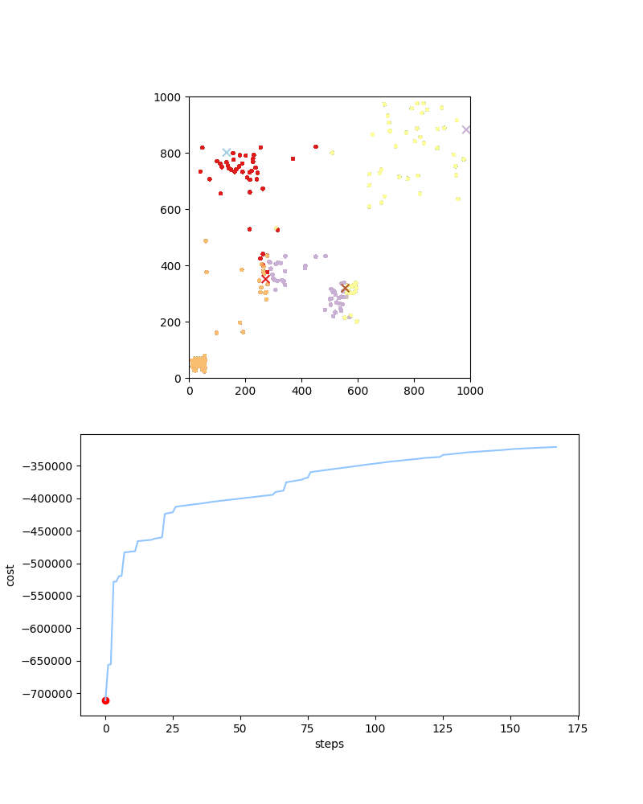

**Capacitated Location allocation**
---

Solves the capacitated location allocation problem, which is an extension of the [facility location problem](https://en.wikipedia.org/wiki/Facility_location_problem) in which all facilities must not exceed a specified capacity.

The approach uses KMeans to select initial facilities following by local search to minimize the total distance between the facilities and the demand locations.

